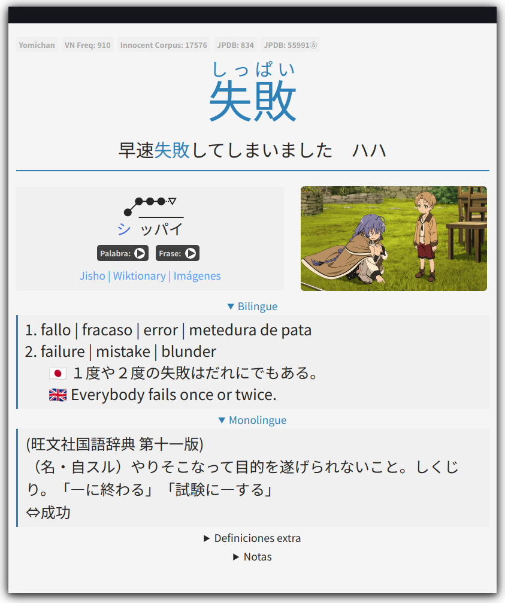

# Anki Note Types

Collection of templates for Anki, primarily aimed to Japanese language learning.

## BrigadaSOS-Japanese

Template for https://brigadasos.xyz/

Dark | Light
:---:|:---:
 | 

### Features
* Can be configured as Monolingual/Bilingual
* Pitch accent coloring
* Yomichan handlebars for exporting pitch accent graphs and frequencies
* Adapted for desktop and mobile
* Automatically adjusts to Light/Dark theme

### Download

(WIP: Ankiweb link)

### How to update

1. Search a card using this template in Anki.
2. Click on `Edit` > `Cards...`
3. Copy the content from `BrigadaSOS-Japanese/Recognition` on each tab 
   * From `front.html` to `Front`
   * From `back.html` to `Back`
   * From `styling.css` to `Styling`
4. Check that the three tabs modified have the same version at the top.

### References

* AnimeCards: https://github.com/friedrich-de/Basic-Mining-Deck
* Aquafina: https://github.com/Aquafina-water-bottle/jp-mining-note
* Tatsumoto: https://ankiweb.net/shared/info/15577228320

### LICENSE

MIT
